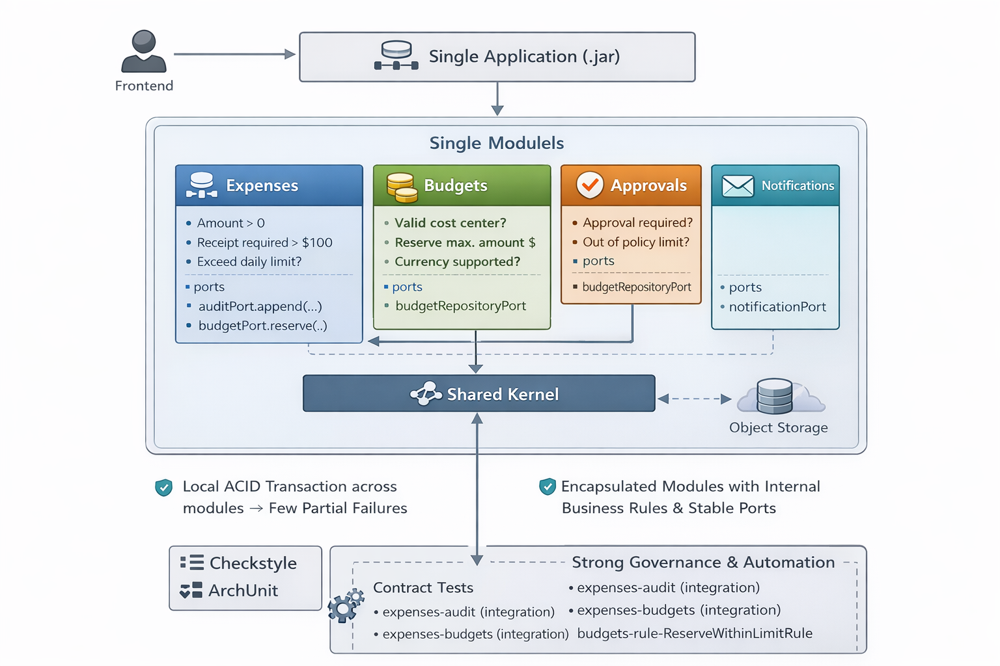

# MMvsMS - Plataforma de Aprovacao de Despesas e Reembolsos

## Visao geral
Este repositorio documenta a proposta de monolito modular para a plataforma interna de aprovacao de despesas e reembolsos. O foco e manter um deployment unico, com encapsulamento real e dependencias controladas entre modulos.

## Objetivos de arquitetura
- Simplicidade operacional com um runtime unico
- Consistencia forte em fluxos criticos (ACID)
- Trilha de auditoria imutavel
- Modulos isolados com APIs internas claras (ports)
- Observabilidade centralizada e uniforme
- Assincrono apenas onde faz sentido (outbox + jobs)

## Modulos
- expenses: agregado Expense e ciclo de vida
- approvals: workflow, estados e aprovadores
- policies: regras e catalogos
- budgets: reserva, centro de custo, limites
- attachments: storage e metadados
- notifications: ports para email/slack
- audit: trilha imutavel de eventos
- shared: tipos comuns e cross cutting

## Fluxos chave
- Criacao de despesa: validacoes + reserva + auditoria na mesma transacao
- Aprovacao: atualizacao de status + confirmacao de reserva + auditoria
- Notificacoes: processadas por jobs apos commit

## Estrategia de deploy e CI/CD (aproveitando modularidade)
- Pipeline unico, mas modular: cada modulo compila e roda testes isolados, com cache e paralelismo.
- Gates obrigatorios: regras de arquitetura (ArchUnit), estilo e testes unitarios por modulo.
- Build do artefato final (ex.: modulo `app`) somente apos passar nos gates modulares.
- Deploy unico com rollout controlado (blue/green ou canary) e feature flags para mudancas sensiveis.
- Migracoes de banco versionadas e executadas antes do start do app, com rollback documentado.
- Observabilidade padrao (logs + traces) garantindo rastreio end-to-end em um runtime.

## Build modular (Maven reactor) - tutorial rapido
O `pom.xml` raiz agrega todos os modulos e permite build/test por parte do sistema sem recompilar tudo.

### Lista de modulos no build
- `app`: runtime final
- `modules/<modulo>/api`: contratos e ports
- `modules/<modulo>/impl`: dominio, aplicacao e infraestrutura
- `architecture-tests`: regras ArchUnit globais

### Exemplos de build seletivo
- Build e teste apenas o API de despesas (e o que ele precisa):
  `mvn -pl modules/expenses/api -am test`
- Build e teste apenas o impl de despesas (traz APIs dependentes):
  `mvn -pl modules/expenses/impl -am test`
- Build do runtime final:
  `mvn -pl app -am package`

### Por que isso e positivo neste modelo
- Reduz o tempo de feedback por modulo, mantendo um deploy unico em producao.
- Reforca boundaries: dependencias entre modulos passam pelo API.
- Permite evoluir um modulo sem precisar recompilar todo o monolito.

## Documentacao
- Arquitetura: `docs/architecture/overview.md`
- Modulos e contratos: `docs/architecture/modules.md`
- Diagramas (Mermaid): `docs/diagrams`
- CI/CD (exemplo): `docs/ci/README.md`

## Estrutura de pastas
- `app/`: runtime final (web/jobs)
- `modules/`: limites de contexto por modulo (`api` e `impl`)
- `architecture-tests/`: regras de arquitetura (ArchUnit)
- `docs/`: documentacao e diagramas

